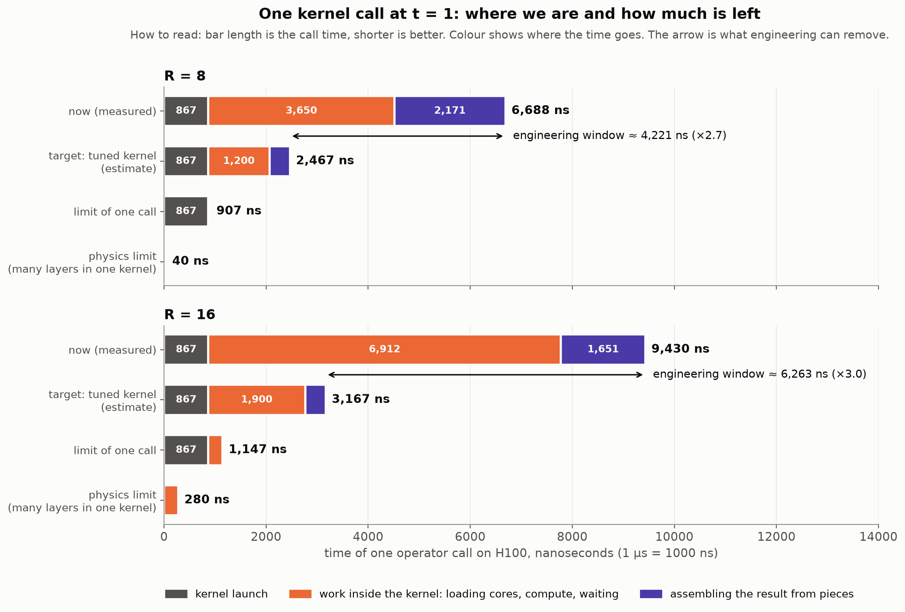
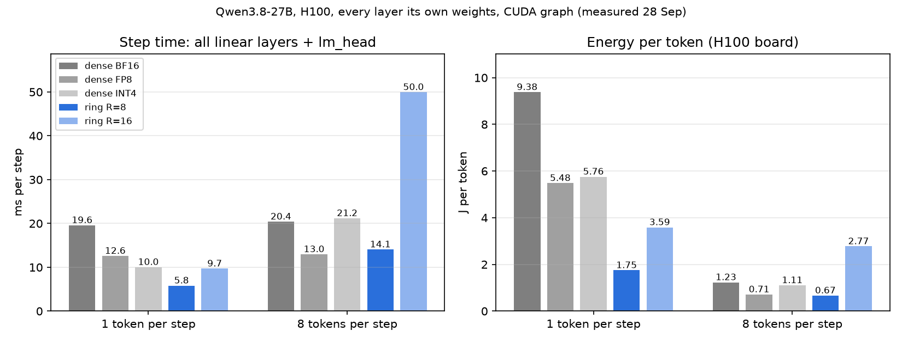
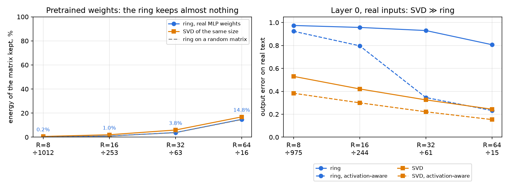
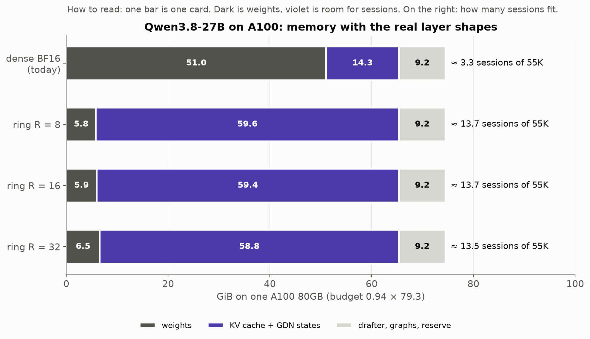
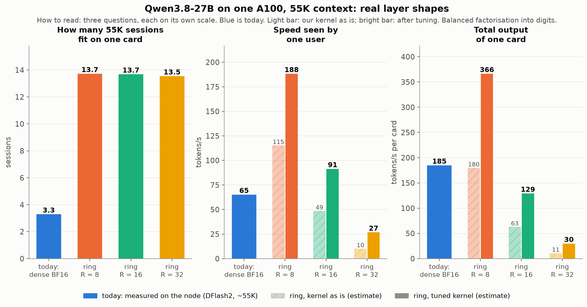

# Tensor-ring weight compression: what was done and where to go next

Draft for the discussion on 29 September 2026 · Danila Permogorsky · updated on the evening of 28 September: measurements on the real layer shapes and the real weights of Qwen3.8-27B (slides 7a–7d)

---

## Summary in one slide

- **Done:** a layer is computed from three small cores instead of a weight matrix, in a single CUDA kernel on H100. On the test layer at R = 8 and one token: **8.2 µs vs 9.8 µs for dense**, with 124× less weight memory.
- **New, 28 September, measured on H100:** the kernel now runs every real layer shape of Qwen3.8-27B in BF16. A whole decode step at one token (all linear layers plus lm_head): **5.8 ms vs 19.6 for dense BF16, 12.6 for FP8 and 10.0 for INT4**. Energy: **1.75 J per token** vs 5.5–9.4. The R = 8 ring beats FP8 up to ~6–10 tokens per call.
- **Quality, measured on the real Qwen weights:** pretrained weights cannot be compressed into an R = 8 / 16 ring. Less than 2% of each matrix survives, the same as for random noise. For pretrained weights the tensorization barely matters. **The ring has to be trained, not fitted onto a finished model.**
- **How:** the method and a cost model were worked out in a Julia lab; all kernel debugging ran on a laptop GPU; the rented H100 was used only for measurements.
- **What limits us:** not arithmetic but latency. Of a 6,700 ns call, arithmetic takes 40 ns. The engineering window is **2.7–3×** per call. The real shapes show the same picture: the kernel waits rather than computes.
- **What it could give, using our current inference as a reference** (Qwen3.8-27B, 2×A100), estimate: **~13–14 sessions per card instead of 3–4**, for any rank up to 32 — if quality can be kept.
- **Speed depends on the rank** (measured on the real shapes): R = 8 beats dense BF16 up to ~10–20 tokens per call, R = 16 up to 2–4.
- **The key question for the researchers:** how to train a model directly in ring format (or distil it into one) so that quality holds at R = 8–16, and which tensorization matches the subspace the data actually lives in.

---

## 1. The idea

Store three small cores instead of the weight matrix. Compute the layer directly from them and never rebuild the matrix.

When a model generates one token at a time (decode), the GPU barely computes: it waits for the weights to arrive from memory. So extra arithmetic is almost free, and the memory the weights used to occupy is freed for the KV cache, that is, for users.

---

## 2. What was done

A kernel for the whole tensor-ring operator from the assignment (input 1920, output 2880), H100 SXM5, FP16.

| 1 token | our kernel | dense (cuBLAS) | reference (PyTorch) |
|---|---|---|---|
| R = 8 | **8.2 µs** | 9.8 µs | 155 µs |
| R = 16 | 10.7 µs | 9.9 µs | 160 µs |

- Correct in all 5 required cases: error ≤ 0.0023 against a tolerance of 0.02.
- One kernel launch instead of the reference's 8 GPU operations and 3 einsum calls.
- Weight memory: 124× smaller at R = 8, 31× at R = 16.
- For several tokens per call there is a separate kernel (V3T): R = 8, 8 tokens — 12.3 µs, 32 tokens — 27.9 µs. There dense is already faster, as expected (slide 3).

---

## 3. Why the numbers are what they are

- At one token, dense does about **1 operation per byte read**, while H100 can do about **300**. The arithmetic units are idle almost all the time.
- The ring reads hundreds of times less but computes more: **3.6× at R = 8** and **25× at R = 16** on the test matrix.
- At R = 8 the extra arithmetic hides inside the waiting, so we win. At R = 16 almost none of it hides, so it is roughly a tie.
- The more tokens per call, the sooner the "free" arithmetic runs out. The boundary:

> **t\* = kernel efficiency × GPU balance point ÷ FLOP overhead**

For H100 and an ideal kernel, t\* ≈ 82 tokens at R = 8 and ≈ 12 at R = 16.

---

## 4. How we worked: model first, hardware second

```
 Julia lab           Julia + CUDA.jl       PyTorch + CUDA C++      H100 (rented)
 laptop, CPU    →    laptop, RTX 3050 Ti → laptop, RTX 3050 Ti  →  measurements only
 the method on       measure the machine,   the kernel and all      prepared
 small problems      test the model         correctness checks      scripts
```

- **A Julia lab of 9 short guides.** The problem was taken apart on examples that can be checked by hand: low rank → an index as a tuple of digits → a ring of 2 cores → a ring of 3 cores → a cost model. The lab's main finding: the ring can be "cut" into independent pieces. The kernel grew out of it.
- **The cost model:** kernel time = max(FLOP ÷ peak, bytes ÷ bandwidth) + latency; call time = max(CPU, GPU). We tested it on the laptop's RTX 3050 Ti with CUDA.jl:
  - 15 GEMM shapes: within ±11% at 32 tokens;
  - the whole chain: first off by 1.4–3.6×, which pointed to one missing parameter — the bandwidth of memory permutes; after the fix, 0.88–1.03;
  - the harness's own JSON: 0.85–1.17, the limiting side correct in 10 rows out of 10.
- This model chose the kernel design before we wrote it. It also produced the node estimates in this talk.
- **The laptop as a correctness rig.** All kernel debugging ran on the RTX 3050 Ti (4 GB): pytest (21 tests), checks against an FP64 oracle, separate checks for V3 and V3T. Nothing was debugged on the H100.
- **H100 for measurements only.** Budget ~$25, about 7 GPU-hours. Each session was a prepared script: create the instance → build → check → measure → push the results to git → delete the instance.
- **Why:** a laptop GPU will not show H100 speed, but it shows honestly whether the kernel computes the right answer. Expensive hardware is spent only on what cannot be learned more cheaply.

---

## 5. The path: three turning points

```
155 µs   reference: 3 einsum + 8 GPU operations, bound by the CPU
  ↓      turn 1: the ring is cut into independent pieces,
  ↓              each fits on the chip entirely
~14 µs   one kernel
  ↓      turn 2: the result of step 2 goes straight into step 3 in registers
  ↓              (the FlashAttention-2 trick): kernel 8.4 → 4.5 µs
10.1 µs  first win over dense
  ↓      turn 3: assembling the result read 12 values one after another —
  ↓              now it reads them all at once
 8.2 µs
```

All three turns removed **waiting**, not arithmetic.

Tried and did not help: all layers in one kernel, dependency counters instead of a barrier, several multiply chains per warp, split-K.

---

## 6. The engineering window of one call



| | R = 8 | R = 16 |
|---|---|---|
| now (measured) | 6,688 ns | 9,430 ns |
| target: tuned kernel (estimate) | ~2,470 ns | ~3,170 ns |
| **window** | **~4,200 ns (2.7×)** | **~6,300 ns (3.0×)** |
| limit of one call | 907 ns | 1,147 ns |
| physics limit | 40 ns | 280 ns |

One call cannot go below ~0.9 µs: that is the price of launching a kernel. Beyond that, the only way is to merge many layers into one kernel.

---

## 6a. What the window is made of and what limits us

One call has three parts, and each is limited by something different.

| part of the call | R = 8 now → target | what happens | what limits it | how to remove it |
|---|---|---|---|---|
| **kernel launch** | 867 → 867 ns | the GPU takes the command and hands blocks to the SMs | the price of any launch: an empty kernel on H100 also takes 0.87 µs | not within one call. Only by merging calls: CUDA graphs, many layers in one kernel |
| **work inside the kernel** | 3,650 → ~1,200 ns | load the cores from L2, step 1, a block barrier, the multiply chain of steps 2–3 | **waiting, not computing:** arithmetic here is 40 ns. Loading 16–24 KB from L2 takes ~0.5 µs; each dependent mma waits ~24 cycles | load the cores while computing; keep several independent multiply chains; fewer barriers |
| **assembling the result** | 2,171 → ~400 ns | each output is a sum of 160 pieces from different blocks: atomics into a shared buffer, a counter, the last block converts FP32 → FP16 | several back-to-back trips to L2, ~0.5 µs each | sum the pieces inside a thread-block cluster through its distributed shared memory (Hopper), not through global memory |

For R = 16 the picture is the same: 867 + 6,912 + 1,651 ns now against 867 + ~1,900 + ~400 ns in the target. The work inside the kernel is larger because the multiply chains are longer.

**How this is confirmed:**
- Nsight Compute on the R = 8 kernel: SMs are filled with warps to 23% (occupancy), with ~19 cycles on average between issued instructions. This is the classic picture of a kernel that waits.
- Each number in the "what limits it" column is a separate microbenchmark on H100.
- All three optimisation turns (slide 5) removed exactly this waiting, and each gave a clear gain.

**The window in short:**
- ~4.2 µs (R = 8) and ~6.3 µs (R = 16) can be removed by engineering: this is pure latency, physics does not require it.
- 0.87 µs of launch cannot be removed within one call.
- 40–280 ns of arithmetic is physics.
- The targets "~1,200 ns of work" and "~400 ns of assembly" are estimates from the microbenchmarks, not measurements.

---

## 7. Honest checks

- **One layer under CUDA graphs:** dense is faster, 5.2 vs 6.8 µs.
- **128 different layers, as in a model:** a tie, 7.0 vs 6.7 µs, with 124× less weight memory.
- **Cold cache, kernel time only:** ours 7.2 µs vs 7.9 µs for dense.

Conclusion: on the 1920 × 2880 test layer we are on par with dense in speed, and the main gain is memory. Real layers are tens of times larger, and the picture changes (slide 7a).

---

## 7a. The real layer shapes of Qwen3.8-27B on H100 (measured 28 September)

The V3T kernel now handles any shape: the mode sizes became template parameters, and BF16 was added (V3G). 107 variants were built for the model's 6 layer shapes, **all checked against an FP64 oracle**. The tiling for each shape comes from a measured table.

One MLP layer 5120 → 17408, µs per call:

| tokens per call | dense BF16 | dense FP8 | dense INT4 | **ring R = 8** | ring R = 16 |
|---|---|---|---|---|---|
| 1 | 62 | 37 | 27 | **11.9** | 22.1 |
| 8 | 64 | 38 | 62 | **36.2** | 136 |
| 32 | 64 | 39 | 201 | 112 | 502 |

- The token count at which the ring stops being faster (large layers):
  - R = 8: from 10–20 against BF16, from 6–10 against FP8;
  - R = 16: from 2–4 against BF16, from 2 against FP8.
- INT4 (tinygemm) is 2–2.4× slower than the R = 8 ring at one token, but that kernel is built for a single token and scales poorly with more.
- **FP8 is compared fairly.** Out of the box in PyTorch (per-row scales, activation quantisation as separate operations), FP8 looked slower than BF16: 74 vs 66 µs. The proper path — one quantisation operation fused into RMSNorm, as inference engines do it — takes 35–37 µs. That is what we compare against.

---

## 7b. A whole decode step: the ring against BF16, FP8 and INT4



All linear layers of the model plus lm_head, each of the ~400 layers with its own weights (the L2 cache does not help), CUDA graph, H100:

| | dense BF16 | FP8 | INT4 | **ring R = 8** | ring R = 16 |
|---|---|---|---|---|---|
| weights, GB | 47.7 | 25.1 | 14.5 | **2.6** | 2.8 |
| 1 token: ms per step | 19.6 | 12.6 | 10.0 | **5.8** | 9.7 |
| 1 token: J per token | 9.4 | 5.5 | 5.8 | **1.75** | 3.6 |
| 8 tokens: ms per step | 20.4 | 13.0 | 21.2 | 14.1 | 50.0 |
| 8 tokens: J per token | 1.23 | 0.71 | 1.11 | 0.67 | 2.77 |

- For a single user the R = 8 ring is **3.4× faster than BF16 and 2.2× faster than FP8**, with 3× less energy. The board draws 300 W instead of 430–570.
- At 8 tokens per step the ring and FP8 are even, and beyond that FP8 wins. The ring is a small-batch tool: a single user, edge devices, verifying speculative decoding in small chunks.
- lm_head is uncompressed in every variant (2.4 GB). Attention, the DeltaNet recurrence and the KV cache are not included here.

---

## 7c. Quality on the real weights: the answer to the key question



The linear layers of 12 blocks of Qwen3.8-27B (8.4 GB) were downloaded. Each matrix was fitted with a ring using TR-SVD and TR-ALS (Zhao et al., 2016) — 368 fits in total. Self-checks of the method:
- a matrix that *is* an R = 8 ring is recovered exactly (error 0.0000);
- our kernel on the fitted cores differs from the ring by 0.3%: all of the loss is in the approximation, not in the kernel.

**Question 1 — does R = 8 / 16 keep a full-size matrix? No.**
- R = 8 (~1000× compression) keeps 0.2–1.7% of a matrix's energy, 0.2–0.6% for MLP. A random matrix keeps the same.
- R = 16 keeps 1–7%. Even R = 64 (16× compression) keeps ~15% of an MLP matrix.
- The reason is the spectrum: real matrices are close to full rank, and 90% of the energy needs rank ~3500 of 5120. An SVD of the same size keeps as much or more. There is no variation with depth.

**Question 2 — does the tensorization matter? For pretrained weights, hardly.**
- Balanced, skewed "FLOP-optimal" (128 × 10 × 4) and balanced after a random shuffle of rows and columns differ only in the third digit.
- So the index order of a pretrained matrix has no structure the ring can use, and the tensorization can be chosen for kernel speed.

**On real inputs (layer 0, real text) the picture is sharper.**
- The layer's inputs are close to low-rank: 50% of their energy lies in 20 directions out of 5120.
- Output error at the R = 8 budget: ring 0.97, SVD of the same size 0.53, activation-aware SVD 0.38.
- A ring fitted with the activations in mind reaches 0.35 at R = 32.
- The ring's rigid mode structure does not line up with the data subspace. A plain low-rank matrix adapts to it.

**Conclusion:** compressing pretrained weights into a ring after training does not work. A ring model has to be **trained** — directly in this format, or by activation-aware distillation. The question for the researchers is which tensorization (and possibly which change of basis) gives the ring a structure that matches the data.

---

## 7d. What is left in the kernel

Nsight Compute on the V3G kernel (layer 5120 → 17408):
- DRAM is 1% busy, the SMs 18–26%;
- 128 blocks on 132 SMs, warp occupancy 12.5%.

The kernel still **waits rather than computes**. Two hypotheses were tested on the evening of 28 September:

- **More warps per block** (512 threads instead of 256): occupancy rose from 12.5% to 25%, but the layer got only 3–8% faster. The model step at 8 tokens: 14.1 → 13.4 ms. Occupancy is not the main limit.
- **Where the time goes** (an experiment with parts of the kernel switched off, µs):

| layer 5120 → 17408 | full call | without atomics | compute only |
|---|---|---|---|
| R = 8, 1 token | 11.8 | 10.1 | 7.7 |
| R = 8, 8 tokens | 34.9 | 27.7 | 20.9 |
| R = 16, 8 tokens | 139.5 | 130.2 | 123.3 |

- At R = 8, **35–40% of the call is assembling the result**: 32 partial sums per output go through L2 as atomics. The next step is to sum them inside a thread-block cluster through Hopper's distributed shared memory. Estimated gain: +15–25%.
- At R = 16 the time is almost all computation: that is the price of R³, and only a lower rank or a better tensorization removes it.

---

## 8. What it could give: an example on our current inference

To estimate the effect on a real service rather than one operator, we take as a **reference** the inference we already run and have measurements for. This is an example, not the target: the roadmap below is not tied to a specific model.

- Qwen3.8-27B BF16, SGLang, 2×A100 80GB, one replica per card, DFlash2 speculative decoding.
- Today: **65 tok/s** per user, **185 tok/s** per card with 4 sessions of ~55K, prefill of 45K tokens in **14.3 s**.
- One card fits 3–4 long sessions: the memory is taken by the weights (51 GiB).

Everything below about the ring is **analysis done together with Claude**, that is, an estimate. The cost model is calibrated on these measurements and matches them within 5–7%. Direct H100 measurements are on slides 7a–7c. The estimates below are for A100 and assume that quality holds at the given rank; slide 7c shows that this requires training a ring model.

---

## 9. Example: real layer shapes (Qwen3.8-27B)

The test matrix in the assignment is small (1920 × 2880). Real models have matrices tens of times larger. These are all the linear layers of the example model:

| layers | shape | count | share of weights |
|---|---|---|---|
| MLP gate / up / down | 5120 ↔ 17408 | 64 × 3 | ~70% |
| GDN `in_proj_qkvz` | 5120 → 16384 | 48 | ~17% |
| GDN `out_proj` | 6144 → 5120 | 48 | ~6% |
| attention q+gate, k, v, o | 5120 → 12288 / 1024 / 1024, 6144 → 5120 | 16 | ~7% |

The FLOP overhead depends on how the matrix sides are tensorized into mode sizes. The main term is R³ ÷ (first input mode × last output mode). Large matrices give large modes, and so less extra arithmetic.

| R | FLOP overhead (balanced tensorization) | same, "FLOP-optimal" tensorization | memory compression |
|---|---|---|---|
| 8 | 1.1× | 0.1× | 895× |
| 16 | 7.7× | 0.5× | 224× |
| 32 | 57× | 3.1× | 56× |

The "FLOP-optimal" tensorization is skewed (for example, 5120 = 128 × 10 × 4). What it does to quality is unknown — a question for the researchers.

---

## 10. Example: memory is the main and robust gain



In the example, for any rank up to 32 the weights shrink to ~6 GiB and almost the whole card goes to sessions: **~13–14 sessions of 55K instead of 3–4**. This conclusion does not depend on the rank.

---

## 11. Example: what would happen to our node



| | sessions | one user, tok/s | total per card, tok/s |
|---|---|---|---|
| **today (measured)** | 3–4 | 65 | 185 |
| R = 8 (kernel as is → tuned) | 13.7 | 115 → **188** | 180 → **366** |
| R = 16 | 13.7 | 49 → 91 | 63 → 129 |
| R = 32 | 13.5 | 10 → 27 | 11 → 30 |
| R = 32, "FLOP-optimal" tensorization | 13.5 | 71 → 122 | 114 → 186 |

- **R = 8:** ~3× faster for one user, ~4× more sessions and ~2× more tokens per card.
- **R = 16:** only memory is gained; speed is below today's.
- **R = 32:** works only if quality holds with "FLOP-optimal" tensorizations.

---

## 12. Prefill: a separate path

Prefill is thousands of tokens at once. Here the GPU computes at full speed, and the ring's extra arithmetic is paid in full. So prefill needs **a different kernel**: rebuild the layer's weights from the cores once, then compute with an ordinary GEMM — the same way INT4 models unpack weights on the fly.

| example: prefill 45K (today 14.3 s) | with our kernel | via weight reconstruction |
|---|---|---|
| R = 8 | ~15.4 s | ~14.5 s |
| R = 16 | ~91 s | ~15.0 s |
| R = 32 | ~660 s | ~17.2 s |

```
           the layer's cores A, B, C (the same for both)
                          │
             how many tokens per call?
               ┌──────────┴──────────┐
          few (decode)          many (prefill)
               │                     │
     our kernel: contraction   rebuild W → ordinary GEMM
     W is never built              (+2–25% to prefill)
               └──────────┬──────────┘
                    layer output
```

The code already has a switch by token count: today it picks between the kernels for one token and for several. Reconstruction becomes the third branch.

---

## 13. Roadmap

| stage | what we do | gate | if not | time |
|---|---|---|---|---|
| 0 ✓ | the operator kernel | — | — | done |
| **1** | pick the target model and **train** its layers in ring format: distillation or activation-aware fine-tuning, then check quality on the target tasks. Pretrained weights cannot be compressed without training (slide 7c) | quality within tolerance | a higher rank; compress only part of the layers (e.g. MLP); FP8 / INT4 as the baseline | 1–3 months, researchers |
| 2 (partly ✓ 28 Sep) | decode kernel for the target model's layer shapes, auto-tuned tiling. Done: V3G for every Qwen3.8-27B shape, a tiling table for H100 | decode no slower than FP8 inference of the same model | keep part of the weights dense together with speculative decoding; TT instead of the ring | 4–8 weeks |
| 3 | prefill via weight reconstruction | time to first token ≤ +10% vs dense | prefill on a separate dense card; the KV cache moves to the ring card in a fraction of a second | 1–2 weeks (buffer + cuBLAS), 4–8 weeks (Marlin-style) |
| 4 | integration into the inference engine (e.g. SGLang): a custom op, CUDA graphs, more sessions per card | A/B against dense: cost per 1M tokens, time to first token, tok/s | raise the session count step by step | 2–4 weeks |
| 5 | megakernel, Hopper-specific tricks, AMD | — | — | later: in the example, kernel launches are ~0.3 ms of a ~9 ms step |

The example numbers (slides 8–12) show what each stage can give. For the target model they have to be recomputed for its layer shapes and its workload.

---

## 14. Three routes by rank

- **R = 8 — "speed + memory".** In the example, faster for the user and ~4× more sessions. The best outcome. Measured on H100: a step at one token is 3.4× faster than BF16 and 2.2× faster than FP8.
- **R = 16 — "memory only".** As many sessions, speed below dense. Makes sense when memory is the main constraint. Measured: 1.3× faster than FP8 at one token, but slower from two tokens on.
- **R = 32 and above — "special tensorizations needed".** Without them the approach does not pay off in speed.

**The dial:** there is no need to compress everything. Part of the layers can be compressed and the rest kept dense together with speculative decoding — a trade-off between memory, speed and quality.

---

## 15. Risks

1. **Quality — measured on 28 September.** Pretrained weights cannot be compressed into an R = 8 / 16 ring: less than 2% of each matrix survives. A trained ring model is needed, and that is the main risk: whether one can be trained with quality within tolerance is not yet known.
2. **Tensorization.** For pretrained weights it barely matters. For trained rings it is an open question: the tensorization decides what structure the ring can learn at all. On real inputs the ring loses to a plain low-rank matrix of the same size.
3. **A strong baseline.** FP8 and INT4 already shrink dense 2–4× with no training and almost no quality loss. The ring beats them only at small batch: against FP8, up to ~6–10 tokens per call.
4. **Awkward sizes.** V3G handles 17408 = 16 × 34 × 32. The price is padding R = 8 to 16 for the Tensor Cores: half of the stage-2 multiplies are wasted. The tiling table exists only for H100.
5. **Integration.** Two paths by token count, a custom op in the inference engine, one buffer per CUDA stream.

---

## 16. The main point

> The kernel runs the real shapes. For a single user a decode step is **3.4× faster than BF16 and 2.2× faster than FP8**, with 3× less energy per token and ~18× less weight memory — that changes the economics of an instance. But a finished model cannot be squeezed into a ring: **the ring model has to be trained**.

The first step is a question for the researchers: **how to train (or distil) a model in ring format so that quality holds at R = 8–16, and which tensorization matches the subspace of the data.**

---

## Appendix: how the numbers were obtained

- Julia lab and cost model: `factorized-abstract-lab/` (guides 00–08); the GPU part used CUDA.jl on an RTX 3050 Ti Laptop.
- H100 measurements: `results/h100/*.json`, final session on 27 September 2026.
- Example, node metrics: the inference-ops repository, `qwen3.6-27b-2-A100` (model Qwen3.8-27B).
- Example, layer shapes: the model's `config.json` (`kernel-design/physics/qwen3.8-27b_config.json`).
- Charts and estimates: `tools/physics_charts.py`, `tools/simple_charts.py`, `tools/qwen_estimate.py`, `tools/qwen_charts.py`, `tools/talk_charts_0928.py` (`--en` for English labels).
- 28 September measurements on H100, all in `results/h100/qwen/`:
  - V3G kernel and correctness — `v3g_sweep.json`, `v3g_sweep2.json` (NT / KS), `check_bf16_v3g*.txt`; where the time goes — `v3g_ablate.json`;
  - per layer against BF16 / FP8 / INT4 — `lowbit.json`;
  - the whole model step with energy — `model_chain_lowbit.json`;
  - quality on the real weights — `quality.json`, walk-through in `quality_review.md`;
  - real inputs — `activation.json`;
  - summaries — `summary.md`, `EXTRA.md`; profiles — `profiles/h100/v3g_*.ncu-rep`.
- 28 September code: the kernel in `src/factorized_inference/csrc/v3g/`; scripts `tools/qwen_*.py`, `tools/v3g_sweep.py`, `tools/tr_quality*.py`, `tools/tr_activation.py`, `tools/lowbit*.py`. The Qwen weights are not stored in the repository: `tools/qwen_fetch_layers.py` downloads them again.
- Assumptions:
  - "tuned kernel" — 30% of Tensor Core peak and 2.5 µs per call;
  - "kernel as is" — 10% of peak and 7 µs per call;
  - share of linear layers in prefill — 80%;
  - rebuilding a weight costs 2R² operations per element;
  - session context — 55K.
