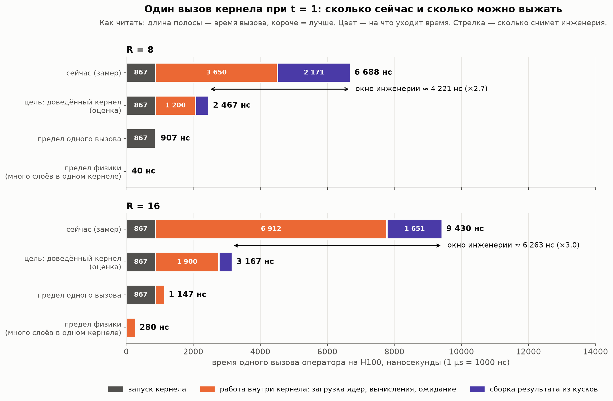
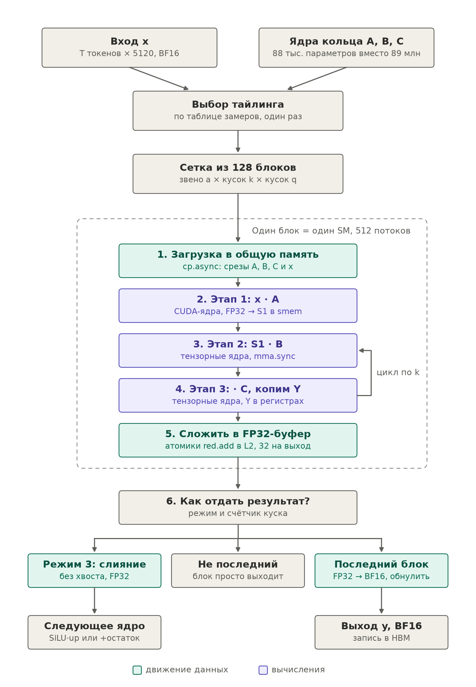
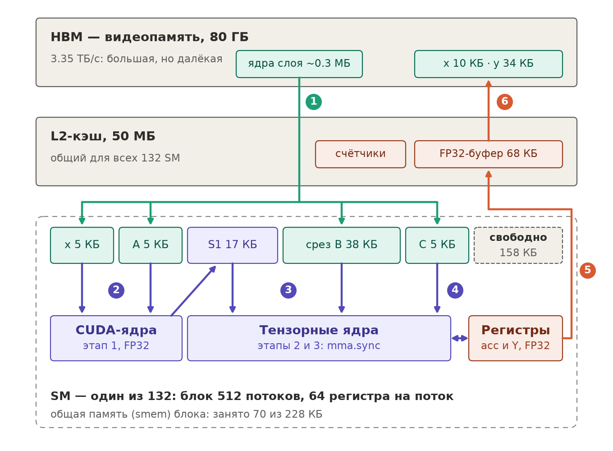
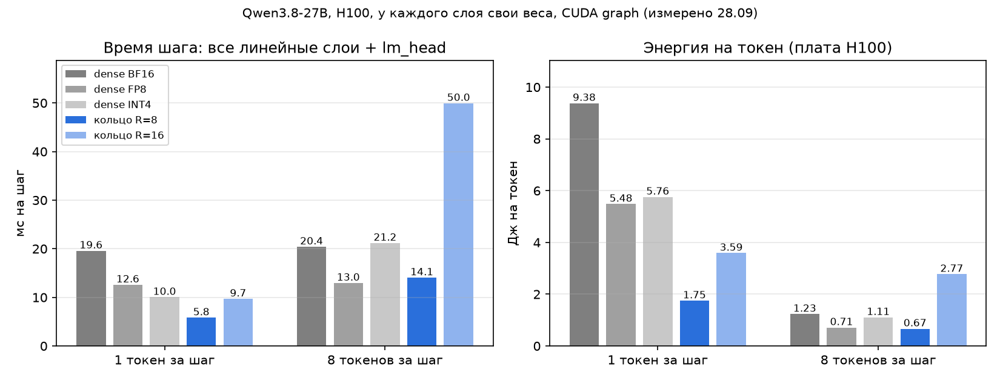
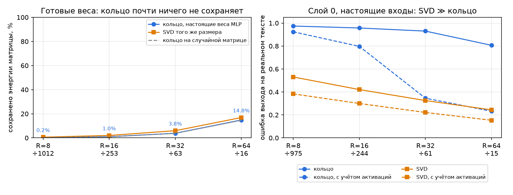
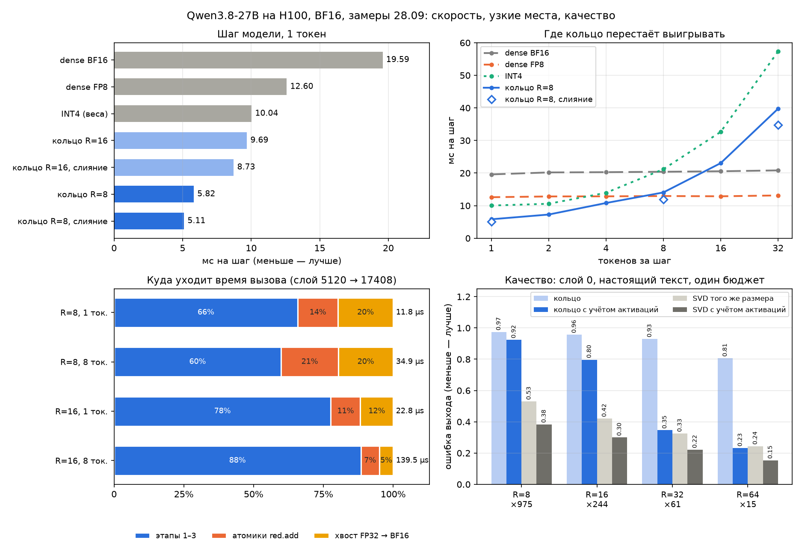
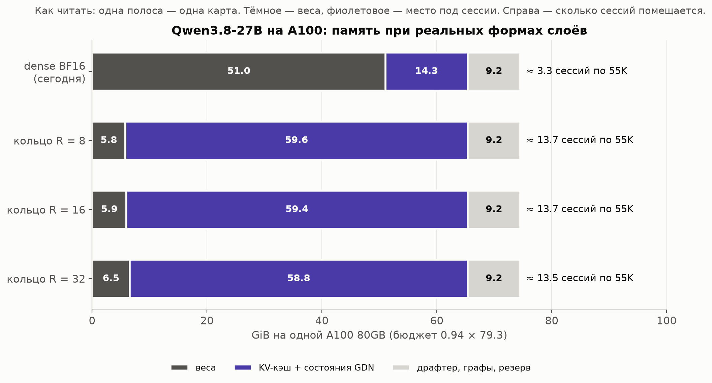
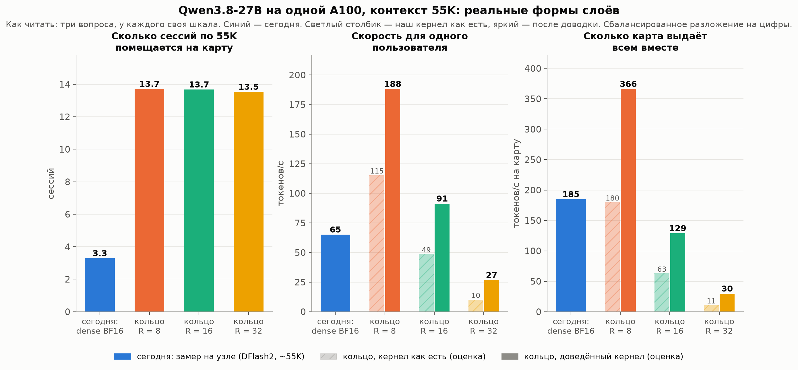

# Кольцевое сжатие весов: что сделано и куда идти

Черновик к обсуждению 29.09.2026 · Данила Пермогорский · обновлено 28.09 вечером: замеры на реальных формах и настоящих весах Qwen3.8-27B (слайды 6б–6в, 7а–7д)

---

## Итог в одном слайде

- **Сделано:** слой считается из трёх маленьких ядер вместо матрицы весов, одним CUDA-кернелом на H100. На тестовом слое при R = 8 и одном токене — **8.2 µs против 9.8 µs у dense**, память весов меньше в 124 раза.
- **Новое, 28.09, измерено на H100:** кернел перенесён на все реальные формы Qwen3.8-27B в BF16. Весь шаг декодирования при одном токене (все линейные слои и lm_head) — **5.8 мс против 19.6 у dense BF16, 12.6 у FP8 и 10.0 у INT4**. Энергия — **1.75 Дж на токен** против 5.5–9.4. Если следующая операция модели читает результат кольца сразу в FP32, шаг — **5.1 мс**, и кольцо R = 8 быстрее FP8 ещё и при 8 токенах за вызов (11.9 против 13.0 мс).
- **Качество, измерено на настоящих весах Qwen:** готовые веса в кольцо R = 8 / 16 не сжимаются — от матрицы остаётся меньше 2%, столько же, сколько от случайного шума. Как раскладывать стороны на множители, для готовых весов почти не важно. **Кольцо нужно обучать, а не накладывать на готовую модель.**
- **Как:** метод и модель стоимости разобраны в лабе на Julia, вся отладка шла на карте ноутбука, H100 брали в аренду только для замеров.
- **Во что упираемся:** не в арифметику, а в задержки. Из 6 700 нс вызова арифметика занимает 40 нс. Окно инженерии — **×2.7–3** на вызов. На реальных формах картина та же: кернел ждёт, а не считает.
- **Что это может дать — на примере** нашего текущего инференса (Qwen3.8-27B, 2×A100) как ориентира, оценка: на карту помещается **~13–14 сессий вместо 3–4** при любом ранге до 32 — если качество удастся сохранить.
- **Скорость зависит от ранга** (измерено на реальных формах): R = 8 быстрее dense BF16 примерно до 10–20 токенов за вызов, R = 16 — до 2–4.
- **Главный вопрос к исследователям:** как обучить модель сразу в кольцевом формате (или дистиллировать в него), чтобы качество держалось при R = 8–16, и какое разложение на множители совпадает с подпространством, в котором живут данные.

---

## 1. Идея

Храним не матрицу весов, а три маленьких ядра. Слой считаем прямо из них и матрицу обратно не собираем.

Когда модель генерирует по одному токену (decode), GPU почти не считает, а ждёт, пока из памяти приедут веса. Поэтому лишняя арифметика почти бесплатна, а память, которую раньше занимали веса, освобождается под KV-кэш — то есть под пользователей.

---

## 2. Что сделано

Кернел для всего кольцевого оператора из задания (вход 1920, выход 2880), H100 SXM5, FP16.

| 1 токен | наш кернел | dense (cuBLAS) | референс (PyTorch) |
|---|---|---|---|
| R = 8 | **8.2 µs** | 9.8 µs | 155 µs |
| R = 16 | 10.7 µs | 9.9 µs | 160 µs |

- Корректен во всех 5 обязательных случаях: ошибка ≤ 0.0023 при допуске 0.02.
- Один запуск кернела вместо 8 GPU-операций и 3 вызовов einsum у референса.
- Память весов: ÷124 при R = 8, ÷31 при R = 16.
- При нескольких токенах за вызов отдельный кернел (V3T): R = 8, 8 токенов — 12.3 µs, 32 токена — 27.9 µs. Здесь dense уже быстрее, и это ожидаемо (слайд 3).

---

## 3. Почему числа именно такие

- При одном токене dense делает около **1 операции на прочитанный байт**, а H100 может делать около **300**. Арифметические блоки почти всё время простаивают.
- Кольцо читает в сотни раз меньше, но считает больше: **×3.6 при R = 8** и **×25 при R = 16** на тестовой матрице.
- У R = 8 лишняя арифметика прячется в ожидании — выигрываем. У R = 16 почти вся уже не прячется — примерно ничья.
- Чем больше токенов за раз, тем быстрее кончается «бесплатная» арифметика. Граница:

> **t\* = КПД кернела × точка баланса GPU ÷ лишняя арифметика**

Для H100 и идеального кернела t\* ≈ 82 токена при R = 8 и ≈ 12 при R = 16.

---

## 4. Как работали: сначала модель, потом железо

```
 Julia-лаба          Julia + CUDA.jl       PyTorch + CUDA C++      H100 (аренда)
 ноутбук, CPU   →    ноутбук, RTX 3050 Ti → ноутбук, RTX 3050 Ti → только замеры
 метод на малых      замерить машину,       кернел и все            заранее готовые
 задачах             проверить модель       проверки корректности   скрипты
```

- **Лаба на Julia, 9 коротких гайдов.** Задачу разобрали на примерах, которые проверяются руками: низкий ранг → индекс как набор цифр → кольцо из 2 ядер → кольцо из 3 ядер → модель стоимости. Главная находка лабы: кольцо можно «разрезать» на независимые куски. Из неё и вырос кернел.
- **Модель стоимости:** время кернела = max(FLOP ÷ пик, байты ÷ ПСП) + задержка, время вызова = max(CPU, GPU). Проверяли на ноутбучной RTX 3050 Ti через CUDA.jl:
  - 15 форм GEMM: точность ±11% при 32 токенах;
  - вся цепочка: сначала промах в 1.4–3.6 раза, он указал на один пропущенный параметр — скорость перестановок в памяти; после поправки 0.88–1.03;
  - JSON самого бенчмарка: 0.85–1.17, узкое место угадано в 10 строках из 10.
- Эта модель выбрала дизайн кернела ещё до того, как мы его написали. Она же посчитала оценки для узла в этой презентации.
- **Ноутбук как стенд корректности.** Вся отладка кернела шла на RTX 3050 Ti (4 GB): pytest (21 тест), сверка с FP64-оракулом, отдельные проверки V3 и V3T. На H100 ничего не отлаживали.
- **H100 — только для замеров.** Бюджет ~$25, это ≈ 7 GPU-часов. Каждая сессия — готовый скрипт: поднять инстанс → собрать → проверить → замерить → забрать результаты в git → удалить инстанс.
- **Почему так:** ноутбучная карта не покажет скорость H100, но честно покажет, правильно ли считает кернел. Дорогое железо тратим только на то, что дешевле не узнать.

---

## 5. Путь: три поворота

```
155 µs   референс: 3 einsum + 8 GPU-операций, упирается в CPU
  ↓      поворот 1: кольцо режется на независимые куски,
  ↓                 каждый помещается на чип целиком
~14 µs   один кернел
  ↓      поворот 2: результат шага 2 сразу идёт в шаг 3 через регистры
  ↓                 (приём FlashAttention-2): кернел 8.4 → 4.5 µs
10.1 µs  первая победа над dense
  ↓      поворот 3: сборка результата читала 12 значений по одному —
  ↓                 теперь читает все сразу
 8.2 µs
```

Все три поворота убирали **ожидание**, а не арифметику.

Проверено и не сработало: все слои в одном кернеле, счётчики зависимостей вместо барьера, несколько цепочек умножений на варп, split-K.

---

## 6. Инженерное окно одного вызова



| | R = 8 | R = 16 |
|---|---|---|
| сейчас (замер) | 6 688 нс | 9 430 нс |
| цель: доведённый кернел (оценка) | ~2 470 нс | ~3 170 нс |
| **окно** | **~4 200 нс (×2.7)** | **~6 300 нс (×3.0)** |
| предел одного вызова | 907 нс | 1 147 нс |
| предел физики | 40 нс | 280 нс |

Ниже ~0.9 µs один вызов не опустится — это цена запуска кернела. Дальше только объединять много слоёв в один кернел.

---

## 6а. Из чего складывается окно и во что упираемся

Один вызов состоит из трёх частей. Каждая упирается во что-то своё.

| часть вызова | R = 8 сейчас → цель | что происходит | во что упирается | чем снимать |
|---|---|---|---|---|
| **запуск кернела** | 867 → 867 нс | GPU принимает команду и раздаёт блоки по SM | цена любого запуска: пустой кернел на H100 тоже 0.87 µs | внутри одного вызова никак. Только объединять вызовы: CUDA graphs, много слоёв в одном кернеле |
| **работа внутри кернела** | 3 650 → ~1 200 нс | загрузить ядра из кэша L2, шаг 1, барьер блока, цепочка умножений шагов 2–3 | **ожидание, а не счёт:** арифметики здесь 40 нс. Загрузка 16–24 KB из L2 — ~0.5 µs, каждое зависимое умножение mma — ~24 такта | загружать ядра одновременно со счётом; держать несколько независимых цепочек умножений; меньше барьеров |
| **сборка результата** | 2 171 → ~400 нс | каждый выход — сумма 160 кусков из разных блоков: атомики в общий буфер, счётчик, последний блок переводит FP32 → FP16 | несколько подряд идущих обращений к L2, каждое ~0.5 µs | складывать куски внутри кластера блоков через общую память кластера (Hopper), а не через глобальную |

Для R = 16 картина та же: 867 + 6 912 + 1 651 нс сейчас против 867 + ~1 900 + ~400 нс в цели. Работа внутри кернела больше, потому что цепочки умножений длиннее.

**Как это подтверждено:**
- Nsight Compute на кернеле R = 8: SM заполнены варпами на 23% (occupancy), в среднем ~19 тактов между выдачей инструкций. Это классическая картина «ждём задержки».
- Каждое число в столбце «во что упирается» — отдельный микротест на H100.
- Все три поворота оптимизации (слайд 5) снимали именно ожидание, и каждый дал заметный выигрыш.

**Итог по окну:**
- ~4.2 µs (R = 8) и ~6.3 µs (R = 16) можно снять инженерией: это чисто задержки, физика их не требует.
- 0.87 µs запуска в одном вызове неустранимы.
- 40–280 нс арифметики — это физика.
- Цели «~1 200 нс работы» и «~400 нс сборки» — оценка по микротестам, а не замер.

---

## 6б. Как работает кернел V3G: блок-схема



Пример — самый тяжёлый слой модели, MLP 5120 → 17408, R = 8, один токен. Плотная матрица — 89 млн весов (178 МБ в BF16). Кольцо — три ядра A, B, C, всего 88 тыс. параметров, в ~1000 раз меньше. Одно умножение на большую матрицу заменяется тремя маленькими подряд.

- **Сетка.** Работа режется тремя способами: по звену кольца a (8 звеньев), по кускам входа k (4 куска по 4) и по кускам выхода q (4 куска до 9). 8 × 4 × 4 = 128 блоков, почти по одному на каждый из 132 SM. Блоки не ждут друг друга.
- **Этап 1 (x · A)** — на обычных CUDA-ядрах в FP32: при R = 8 он слишком узкий для тензорных ядер.
- **Этапы 2 и 3 (· B, · C)** — на тензорных ядрах (`mma.sync`). Результат этапа 2 сразу становится входом этапа 3 прямо в регистрах и не уходит в память — это главная находка кернела (V3T). Y копится в регистрах по 4 значениям k.
- **Сборка.** Ломтики разных блоков — части одного и того же выхода. Их складывают атомиками `red.add` в общий FP32-буфер: 8 звеньев × 4 куска k = 32 добавки на каждый выход.
- **Выдача.** Счётчик куска находит последний блок: тот переводит сумму в BF16 и обнуляет буфер (хвост). В режиме 3 хвоста нет: FP32 сразу забирает следующая операция модели (SiLU·up в MLP или сложение с residual) и сама чистит буфер.
- Тайлинг (сколько k и q на блок, 256 или 512 потоков) выбирается один раз по таблице замеров для каждой формы. Искать моды во время работы не нужно.

---

## 6в. Память H100: где лежат данные и куда они едут



Три «этажа»: HBM — большой склад (80 ГБ, 3.35 ТБ/с), L2 — общая полка у выхода (50 МБ), shared memory и регистры — рабочий стол каждого SM (228 КБ smem на SM).

1. **Загрузка.** Блок копирует (`cp.async`) в smem свой срез: B для своих q (38 КБ), A для своего звена (5 КБ), C для своих k (5 КБ) и кусок входа x в FP32 (5 КБ). Все ядра слоя занимают в памяти ~0.3 МБ (88 тыс. параметров плюс выравнивание). Их читают 128 блоков, но из HBM они приходят один раз, дальше — из L2.
2. **Этап 1.** CUDA-ядра считают x · A в FP32 и кладут S1 (17 КБ) обратно в smem в BF16, в раскладке для тензорных ядер.
3. **Этап 2.** Тензорные ядра считают S1 · B, результат acc остаётся в регистрах.
4. **Этап 3.** acc сразу идёт во второй `mma` с ядром C, Y копится в регистрах.
5. **Сборка.** Y добавляется атомиком `red.add.v2.f32` в FP32-буфер (68 КБ на токен), который живёт в L2.
6. **Хвост.** Последний блок куска читает сумму из L2, пишет y в BF16 и обнуляет буфер. В режиме 3 это делает следующее ядро модели.

**Главное отличие от dense.** Плотный слой на каждом шаге везёт из HBM все 178 МБ весов, и его скорость — это пропускная способность HBM: 62 µs ≈ 178 МБ / 2.9 ТБ/с. Кольцу возить почти нечего: по Nsight Compute HBM загружена на 1%. Кернел упирается не в память, а в задержки — загрузки, синхронизации, атомики. Блоку хватает 70 КБ smem из 228.

---

## 7. Честные проверки

- **Под CUDA graphs один слой:** dense быстрее, 5.2 против 6.8 µs.
- **128 разных слоёв, как в модели:** ничья, 7.0 против 6.7 µs, при весах в 124 раза меньше.
- **Холодный кэш, чистое время кернела:** наш 7.2 µs против 7.9 µs у dense.

Вывод: на тестовом слое 1920 × 2880 по скорости мы наравне с dense, главный выигрыш — в памяти. На реальных формах матрицы в десятки раз больше, и картина другая (слайд 7а).

---

## 7а. Реальные формы Qwen3.8-27B на H100 (замер 28.09)

Кернел V3T обобщён на любые формы: моды стали параметром шаблона, добавлен BF16 (V3G). Собрано 746 вариантов под 6 форм слоёв модели, **все сверены с FP64-оракулом**. Тайлинг под каждую форму выбирается по таблице замеров.

Один слой MLP 5120 → 17408, µs на вызов:

| токенов за вызов | dense BF16 | dense FP8 | dense INT4 | **кольцо R = 8** | кольцо R = 16 |
|---|---|---|---|---|---|
| 1 | 62 | 37 | 27 | **11.9** | 22.1 |
| 8 | 64 | 38 | 62 | **36.2** | 136 |
| 32 | 64 | 39 | 201 | 112 | 502 |

- С какого числа токенов кольцо перестаёт быть быстрее (по большим слоям):
  - R = 8: против BF16 — с 10–20, против FP8 — с 6–10;
  - R = 16: против BF16 — с 2–4, против FP8 — с 2.
- INT4 (tinygemm) при одном токене в 2–2.4 раза медленнее кольца R = 8, но его кернел рассчитан на один токен и плохо растёт с их числом.
- **FP8 сравниваем честно.** FP8 в PyTorch «как есть» (построчные масштабы и квантование активаций отдельными операциями) выглядел медленнее BF16: 74 против 66 µs. Правильный путь — одна операция квантования, слитая с RMSNorm, как в движках инференса, — даёт 35–37 µs. Сравниваем с ним.

---

## 7б. Весь шаг декодирования: кольцо против BF16, FP8, INT4



Все линейные слои модели и lm_head, у каждого из ~400 слоёв свои веса (кэш L2 не подыгрывает), CUDA graph, H100:

| | dense BF16 | FP8 | INT4 | **кольцо R = 8** | кольцо R = 16 |
|---|---|---|---|---|---|
| веса, ГБ | 47.7 | 25.1 | 14.5 | **2.6** | 2.8 |
| 1 токен: мс на шаг | 19.6 | 12.6 | 10.0 | **5.8** | 9.7 |
| 1 токен: Дж на токен | 9.4 | 5.5 | 5.8 | **1.75** | 3.6 |
| 8 токенов: мс на шаг | 20.4 | 13.0 | 21.2 | 14.1 | 50.0 |
| 8 токенов: Дж на токен | 1.23 | 0.71 | 1.11 | 0.67 | 2.77 |

- При одном пользователе кольцо R = 8 в **3.4 раза быстрее BF16 и в 2.2 раза быстрее FP8**, энергии в 3 раза меньше. Плата работает на 300 Вт вместо 430–570.
- При 8 токенах за шаг кольцо и FP8 наравне, дальше FP8 выигрывает. Кольцо — инструмент малого батча: один пользователь, edge, проверка спекулятивного декодирования малыми порциями.
- lm_head во всех вариантах несжатый (2.4 ГБ). Внимание, рекуррентная часть DeltaNet и KV-кэш здесь не считались.

---

## 7в. Качество на настоящих весах: ответ на главный вопрос



Скачаны линейные слои 12 блоков Qwen3.8-27B (8.4 ГБ). Каждая матрица приближена кольцом алгоритмами TR-SVD и TR-ALS (Zhao et al., 2016) — всего 368 подгонок. Автопроверки метода:
- матрицу, которая сама является кольцом R = 8, подгонка восстанавливает точно (ошибка 0.0000);
- наш кернел на подогнанных ядрах отличается от кольца на 0.3%: вся потеря — в приближении, а не в кернеле.

**Вопрос 1 — держит ли R = 8 / 16 матрицу реального размера? Нет.**
- R = 8 (сжатие ~1000×) сохраняет 0.2–1.7% энергии матрицы, у MLP 0.2–0.6%. Столько же сохраняется от случайной матрицы.
- R = 16 сохраняет 1–7%. Даже R = 64 (сжатие 16×) сохраняет у MLP ~15%.
- Причина — спектр: настоящие матрицы почти полноранговые, для 90% энергии нужен ранг ~3500 из 5120. SVD того же размера сохраняет столько же или больше. По глубине сети разброса нет.

**Вопрос 2 — важно ли разложение на множители? Для готовых весов почти нет.**
- Сбалансированное, «выгодное» перекошенное (128 × 10 × 4) и сбалансированное после случайной перестановки строк и столбцов расходятся только в третьем знаке.
- Значит, в порядке индексов готовой матрицы нет структуры для кольца, и разложение можно выбирать по скорости кернела.

**На настоящих входах (слой 0, реальный текст) картина точнее.**
- Входы слоя почти низкоранговые: 50% их энергии лежит в 20 направлениях из 5120.
- Ошибка выхода при бюджете R = 8: кольцо 0.97, SVD того же размера 0.53, SVD с учётом активаций 0.38.
- Кольцо, подогнанное с учётом активаций, при R = 32 доходит до 0.35. Но SVD с учётом активаций того же размера даёт 0.22: при любом бюджете SVD лучше.
- Жёсткая структура мод кольца не совпадает с подпространством данных. Обычная низкоранговая матрица под него подстраивается.

**Вывод:** сжимать готовые веса в кольцо после обучения бессмысленно. Кольцевую модель нужно **обучать** — сразу в этом формате или дистилляцией с учётом активаций. Вопрос к исследователям — какое разложение (и, возможно, какой поворот базиса) даёт кольцу структуру, совпадающую с данными.

---

## 7г. Что осталось в кернеле

Nsight Compute на кернеле V3G (слой 5120 → 17408):
- DRAM загружена на 1%, SM — на 18–26%;
- 128 блоков на 132 SM, заполненность SM варпами (occupancy) — 12.5%.

Кернел по-прежнему **ждёт, а не считает**. Вечером 28.09 проверили две гипотезы:

- **Больше варпов на блок** (512 потоков вместо 256): occupancy выросла с 12.5% до 25%, но слой ускорился лишь на 3–8%. Шаг модели при 8 токенах: 14.1 → 13.4 мс. Заполненность SM не главный ограничитель.
- **Где уходит время** (опыт с отключёнными частями кернела, µs):

| слой 5120 → 17408 | весь вызов | без атомиков | только вычисления |
|---|---|---|---|
| R = 8, 1 токен | 11.8 | 10.1 | 7.7 |
| R = 8, 8 токенов | 34.9 | 27.7 | 20.9 |
| R = 16, 8 токенов | 139.5 | 130.2 | 123.3 |

- При R = 8 **35–40% вызова — сборка результата**: 32 частичные суммы на каждый выход идут атомиками через L2, и последний блок переводит FP32 → BF16.
- **Проверено и не сработало: сумма внутри кластера блоков** через распределённую shared memory (Hopper), 2–8 связей кольца на кластер. Все варианты корректны, но медленнее: mlp_gate_up R = 8, 1 токен — 11.2 µs без кластера, 12.2 при кластере из 2 блоков, 14.5 из 8. Атомики `red` не заставляют варп ждать и перекрываются со счётом. Кластер добавляет две синхронизации, в которых все блоки ждут самого медленного, и шаг редукции, который ни с чем не перекрывается.
- **Сработало: выход в FP32 и слияние со следующей операцией.** Кернел отдаёт результат в FP32-буфере и не делает хвост (последний блок больше не переводит FP32 → BF16). Следующая операция модели сама читает FP32 и обнуляет буфер: для MLP это одно ядро `silu(gate) · up`, для выходных проекций — сложение с residual. Блок MLP при R = 8 и 1 токене: 41.5 → 33.3 µs (×1.25), и точнее, потому что промежуточный результат остаётся в FP32. Весь шаг модели:

| | R = 8, 1 токен | R = 8, 8 токенов | R = 16, 1 токен |
|---|---|---|---|
| с хвостом | 5.77 мс | 13.2 мс | 9.57 мс |
| выход в FP32 + слияние | **5.11 мс** | **11.9 мс** | 8.73 мс |

При 8 токенах кольцо R = 8 теперь быстрее и FP8 (13.0 мс). Часть выигрыша — слияние поэлементных операций, которое dense тоже может получить. По оценке это ~0.1–0.2 мс на шаг, вывод это не меняет. Для q / k / v и qkvz хвост пока остаётся: их потребители — внимание и DeltaNet, а они в симуляции не считаются.
- При R = 16 время почти целиком уходит на вычисления: это цена R³, и её снимает только меньший ранг или лучшее разложение.

---

## 7д. Итоги в цифрах



- **Скорость (слева вверху).** Шаг модели при одном токене: кольцо R = 8 — 5.82 мс, со слиянием — 5.11 мс (отдельный прогон; кольцо без слияния в нём 5.77). Это против 19.59 у dense BF16 (×3.8), 12.60 у FP8 (×2.5) и 10.04 у INT4 (×2.0). Энергия — 1.6–1.75 Дж на токен против 9.4 у BF16 и 5.5 у FP8.
- **Предел (справа вверху).** Время кольца растёт с числом токенов, у FP8 почти нет. При 8 токенах кольцо R = 8 без слияния чуть медленнее FP8 (14.1 против 13.0 мс), со слиянием — быстрее (11.9). С 16 токенов выигрывает FP8. Кольцо — инструмент малого батча.
- **Узкие места (слева внизу).** При R = 8 треть вызова — сборка результата: атомики 14–21%, хвост 20%. Хвост убирается режимом 3. При R = 16 78–88% вызова — сами вычисления, это цена R³.
- **Качество (справа внизу), при одном и том же бюджете параметров.** SVD с учётом активаций лучше кольца при любом R: при R = 8 — 0.38 против 0.92, при R = 32 — 0.22 против 0.35. Готовые веса в кольцо R = 8–16 не переносятся.
- **Память весов.** 2.6 ГБ против 47.7 у dense. Из них 2.4 ГБ — несжатый lm_head, сами кольцевые слои занимают ~0.2 ГБ вместо 45.3.

**Вывод:** кернел готов и быстр на малом батче. Узкое место проекта — качество: кольцевую модель нужно обучать или дистиллировать. Это вопрос к исследователям, а не к кернелу.

---

## 8. Что это может дать: пример на нашем текущем инференсе

Чтобы оценить эффект не на одном операторе, а на реальном сервисе, возьмём как **ориентир** инференс, который у нас уже работает и для которого есть снятые метрики. Это пример, а не цель: roadmap ниже не привязан к конкретной модели.

- Qwen3.8-27B BF16, SGLang, 2×A100 80GB, по реплике на карту, спекулятивный декодинг DFlash2.
- Сегодня: **65 tok/s** на пользователя, **185 tok/s** на карту при 4 сессиях по ~55K, prefill 45K токенов за **14.3 с**.
- На карте помещается 3–4 длинные сессии: память занята весами (51 GiB).

Всё, что ниже про кольцо, — **аналитика, сделанная вместе с Claude**, то есть оценка. Модель стоимости откалибрована по этим замерам и совпадает с ними в пределах 5–7%. Прямые замеры на H100 — на слайдах 7а–7в. Оценки ниже сделаны для A100 и предполагают, что качество при данном ранге держится; слайд 7в показывает, что для этого кольцевую модель нужно обучать.

---

## 9. Пример: реальные формы слоёв (Qwen3.8-27B)

Тестовая матрица в задании маленькая (1920 × 2880). У настоящих моделей матрицы в десятки раз больше. Вот все линейные слои модели из примера:

| слои | форма | сколько | доля весов |
|---|---|---|---|
| MLP gate / up / down | 5120 ↔ 17408 | 64 × 3 | ~70% |
| GDN `in_proj_qkvz` | 5120 → 16384 | 48 | ~17% |
| GDN `out_proj` | 6144 → 5120 | 48 | ~6% |
| внимание q+гейт, k, v, o | 5120 → 12288 / 1024 / 1024, 6144 → 5120 | 16 | ~7% |

Лишняя арифметика зависит от того, как разложить стороны матрицы на множители. Главное слагаемое — R³ ÷ (первый множитель входа × последний множитель выхода). Большие матрицы дают крупные множители, поэтому арифметики меньше.

| R | лишняя арифметика (сбалансированное разложение) | то же, «выгодное» разложение | сжатие памяти |
|---|---|---|---|
| 8 | ×1.1 | ×0.1 | ÷895 |
| 16 | ×7.7 | ×0.5 | ÷224 |
| 32 | ×57 | ×3.1 | ÷56 |

«Выгодное» разложение перекошено (например, 5120 = 128 × 10 × 4). Что оно делает с качеством, неизвестно — это вопрос к исследователям.

---

## 10. Пример: память — главный и надёжный выигрыш



В примере при любом ранге до 32 от весов остаётся ~6 GiB, и почти вся карта уходит под сессии: **~13–14 сессий по 55K вместо 3–4**. Этот вывод не зависит от ранга.

---

## 11. Пример: что было бы с нашим узлом



| | сессий | 1 пользователь, tok/s | сумма на карту, tok/s |
|---|---|---|---|
| **сегодня (замер)** | 3–4 | 65 | 185 |
| R = 8 (кернел как есть → доведённый) | 13.7 | 115 → **188** | 180 → **366** |
| R = 16 | 13.7 | 49 → 91 | 63 → 129 |
| R = 32 | 13.5 | 10 → 27 | 11 → 30 |
| R = 32, «выгодное» разложение | 13.5 | 71 → 122 | 114 → 186 |

- **R = 8:** в ~3 раза быстрее для одного пользователя, в ~4 раза больше сессий и в ~2 раза больше токенов на карту.
- **R = 16:** выигрываем только память, скорость ниже сегодняшней.
- **R = 32:** работает, только если качество держится на «выгодных» разложениях.

---

## 12. Prefill: отдельный путь

Prefill — это тысячи токенов за раз. Здесь GPU считает на полную, и лишняя арифметика кольца оплачивается целиком. Поэтому для prefill нужен **другой кернел**: один раз собрать веса слоя из ядер и дальше считать обычным GEMM — так же, как INT4-модели распаковывают веса на лету.

| пример: prefill 45K (сегодня 14.3 с) | нашим кернелом | через восстановление весов |
|---|---|---|
| R = 8 | ~15.4 с | ~14.5 с |
| R = 16 | ~91 с | ~15.0 с |
| R = 32 | ~660 с | ~17.2 с |

```
            ядра слоя A, B, C (одни и те же)
                        │
            сколько токенов за вызов?
               ┌────────┴─────────┐
            мало (decode)     много (prefill)
               │                  │
      наш кернел: свёртка   восстановить W → обычный GEMM
      W не собирается           (+2–25% к prefill)
               └────────┬─────────┘
                    выход слоя
```

Переключатель по числу токенов в коде уже есть: сейчас он выбирает между кернелами для одного и для нескольких токенов. Восстановление станет третьей веткой.

---

## 13. Roadmap

| этап | что делаем | условие перехода | если нет | срок |
|---|---|---|---|---|
| 0 ✓ | кернел оператора | — | — | сделано |
| **1** | выбрать целевую модель и **обучить** её слои в кольцевом формате: дистилляция или дообучение с учётом активаций, потом проверка качества на целевых задачах. Сжать готовые веса без обучения нельзя (слайд 7в) | качество в допуске | больший ранг; сжимать только часть слоёв (например, MLP); FP8 / INT4 как база | 1–3 мес., исследователи |
| 2 (частично ✓ 28.09) | decode-кернел под формы слоёв целевой модели, автотюнинг раскладки. Готово: V3G под все формы Qwen3.8-27B, таблица тайлингов для H100 | decode не медленнее FP8-инференса той же модели | оставить часть весов dense вместе со спекулятивным декодингом; TT вместо кольца | 4–8 нед. |
| 3 | prefill через восстановление весов | время до первого токена ≤ +10% к dense | prefill на отдельной dense-карте, KV-кэш переносится на кольцевую за доли секунды | 1–2 нед. (буфер + cuBLAS), 4–8 нед. (как Marlin) |
| 4 | интеграция в движок инференса (например, SGLang): свой op, CUDA graphs, больше сессий на карту | A/B против dense: цена 1M токенов, время до первого токена, tok/s | поднимать число сессий ступенями | 2–4 нед. |
| 5 | megakernel, Hopper-приёмы, AMD | — | — | потом: в примере запуски кернелов — ~0.3 мс из ~9 мс шага |

Цифры из примера (слайды 8–12) — ориентир того, что даёт каждый этап. Для целевой модели их нужно пересчитать под её формы слоёв и её нагрузку.

---

## 14. Три маршрута по рангу

- **R = 8 — «скорость + память».** В примере быстрее для пользователя и в ~4 раза больше сессий. Лучший исход. Измерено на H100: шаг при одном токене в 3.4 раза быстрее BF16 и в 2.2 раза быстрее FP8.
- **R = 16 — «только память».** Сессий столько же, скорость ниже dense. Имеет смысл, если память — главное ограничение. Измерено: при одном токене в 1.3 раза быстрее FP8, но уже с двух токенов медленнее.
- **R = 32 и выше — «нужны особые разложения».** Без них подход по скорости не работает.

**Регулятор:** не обязательно сжимать всё. Можно сжать часть слоёв, а остальные оставить dense вместе со спекулятивным декодингом — это компромисс между памятью, скоростью и качеством.

---

## 15. Риски

1. **Качество — измерено 28.09.** Готовые веса в кольцо R = 8 / 16 не сжимаются: остаётся меньше 2% матрицы. Нужна обученная кольцевая модель, и это главный риск: получится ли её обучить с качеством в допуске, пока неизвестно.
2. **Разложение на множители.** Для готовых весов почти не влияет. Для обучаемых колец это открытый вопрос: разложение задаёт, какую структуру кольцо вообще может выучить. На настоящих входах кольцо проигрывает обычной низкоранговой матрице того же размера.
3. **Сильная база.** FP8 и INT4 уже уменьшают dense в 2–4 раза без обучения и почти без потери качества. Кольцо выигрывает у них только при малом батче: против FP8 — до ~6–10 токенов за вызов.
4. **Неудобные размеры.** 17408 = 16 × 34 × 32 кернел V3G считает. Цена — дополнение R = 8 до 16 для тензорных ядер: половина умножений этапа 2 уходит впустую. Таблица тайлингов снята только для H100.
5. **Интеграция.** Два пути по числу токенов, свой op в движке инференса, отдельный буфер на каждый стрим.

---

## 16. Главная мысль

> Кернел на реальных формах есть. При одном пользователе шаг декодирования в **3.4 раза быстрее BF16 и в 2.2 раза быстрее FP8** (со слиянием выхода в FP32 со следующей операцией — в 3.8 и 2.5 раза), энергии на токен в 3 раза меньше, весов в ~18 раз меньше — это меняет экономику инстанса. Но готовую модель в кольцо не сжать: **кольцевую модель нужно обучать**.

Первый шаг — вопрос к исследователям: **как обучить (или дистиллировать) модель в кольцевом формате, чтобы качество держалось при R = 8–16, и какое разложение совпадает с подпространством данных.**

---

## Приложение: как считали

- Лаба на Julia и модель стоимости: `factorized-abstract-lab/` (гайды 00–08), GPU-часть — CUDA.jl на RTX 3050 Ti Laptop.
- Замеры H100: `results/h100/*.json`, финальная сессия 27.09.2026.
- Пример, метрики узла: репозиторий inference-ops, `qwen3.6-27b-2-A100` (модель Qwen3.8-27B).
- Пример, формы слоёв: `config.json` модели (`kernel-design/physics/qwen3.8-27b_config.json`).
- Графики и оценки: `tools/physics_charts.py`, `tools/simple_charts.py`, `tools/qwen_estimate.py`, `tools/qwen_charts.py`, `tools/talk_charts_0928.py`.
- Замеры 28.09 на H100, всё в `results/h100/qwen/`:
  - кернел V3G и корректность — `v3g_sweep.json`, `v3g_sweep2.json` (NT / KS), `v3g_sweep3.json` (кластеры), `check_bf16_v3g*.txt`; куда уходит время — `v3g_ablate*.json`; выход в FP32 со слиянием — `v3g_fp32out.json`, `model_chain_fp32out.json`;
  - сравнение с BF16 / FP8 / INT4 по слоям — `lowbit.json`;
  - весь шаг модели с энергией — `model_chain_lowbit.json`;
  - качество на настоящих весах — `quality.json`, разбор в `quality_review.md`;
  - настоящие входы — `activation.json`;
  - сводки — `summary.md`, `EXTRA.md`; профили — `profiles/h100/v3g_*.ncu-rep`.
- Код 28.09: кернел `src/factorized_inference/csrc/v3g/`; скрипты `tools/qwen_*.py`, `tools/v3g_sweep.py`, `tools/tr_quality*.py`, `tools/tr_activation.py`, `tools/lowbit*.py`. Веса Qwen в репозиторий не кладутся — их заново скачивает `tools/qwen_fetch_layers.py`.
- Допущения:
  - «доведённый кернел» — 30% пика Tensor Core и 2.5 µs на вызов;
  - «как есть» — 10% пика и 7 µs на вызов;
  - доля линейных слоёв в prefill — 80%;
  - восстановление веса стоит 2R² операций на элемент;
  - контекст сессии — 55K.
